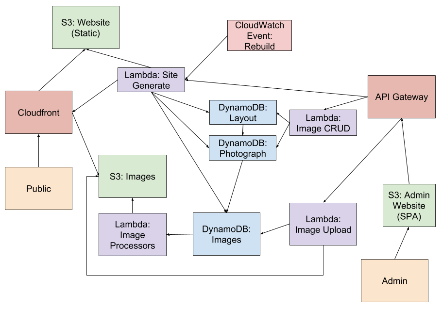

# Photography

A serverless personal photography website.

Playing around with the [serverless](https://github.com/serverless/serverless) framework for hosting my photography website at very minimal cost.

## Installation

```
npm install -g serverless
cd src
dotnet restore
```

## Deployment

```
./build.sh
sls deploy
```

## Architecture



The original (and probably most up to date) diagram is [here](https://docs.google.com/drawings/d/1bWO_n-EJH5N4NxZV0H3L5mgzImvndEI_i47nRyrZGTA/edit?usp=sharing)
