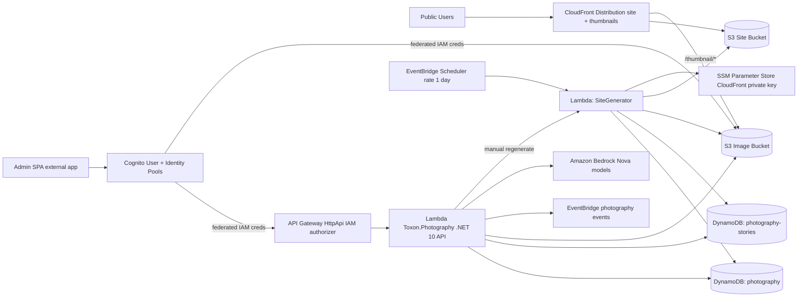

# Photography

A serverless personal photography website.

Playing around with the [AWS SAM](https://aws.amazon.com/serverless/sam/) tool for hosting my photography website at very minimal cost.

## Deployment

```
sam build
sam validate
sam deploy 
```

once confirmed in dev, promote to production using:

```
sam deploy --config-env prod 
```

## Architecture

Current AWS architecture (from `template.yaml`):


```mermaid
flowchart LR
  Public[Public Users]
  Admin[Admin SPA external app]

  CF[CloudFront Distribution site + thumbnails]
  SiteBucket[(S3 Site Bucket)]
  ImageBucket[(S3 Image Bucket)]

  Cognito[Cognito User + Identity Pools]
  HttpApi[API Gateway HttpApi IAM authorizer]
  ApiLambda[Lambda Toxon.Photography .NET 10 API]

  PhotoTable[(DynamoDB: photography)]
  StoryTable[(DynamoDB: photography-stories)]
  EventBridge[EventBridge photography events]
  Bedrock[Amazon Bedrock Nova models]

  Scheduler[EventBridge Scheduler rate 1 day]
  SiteGen[Lambda: SiteGenerator]
  Ssm[SSM Parameter Store CloudFront private key]

  Public --> CF
  CF --> SiteBucket
  CF -->|/thumbnail/*| ImageBucket

  Admin --> Cognito
  Cognito -->|federated IAM creds| HttpApi
  Cognito -->|federated IAM creds| ImageBucket

  HttpApi --> ApiLambda
  ApiLambda --> PhotoTable
  ApiLambda --> StoryTable
  ApiLambda --> ImageBucket
  ApiLambda --> EventBridge
  ApiLambda --> Bedrock
  ApiLambda -->|manual regenerate| SiteGen

  Scheduler --> SiteGen
  SiteGen --> PhotoTable
  SiteGen --> StoryTable
  SiteGen --> ImageBucket
  SiteGen --> SiteBucket
  SiteGen --> Ssm
```

Notes:
- CloudFront uses Origin Access Control (OAC) for both S3 origins.
- Thumbnail paths are protected with a trusted key group and signed URLs.
- Site generation runs daily and can also be triggered manually via the API.
